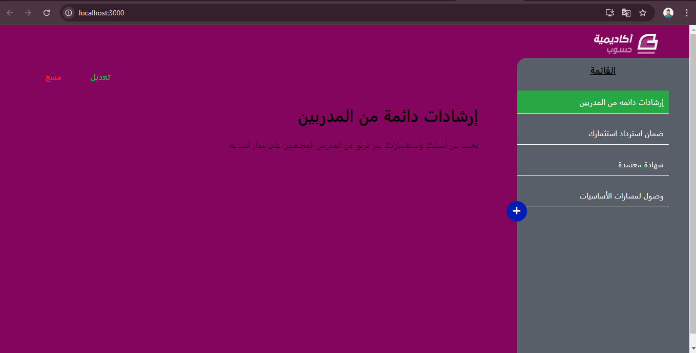

# **MyNote Application**

This is a simple and intuitive MyNote web application where users can add, view, update, and delete notes. The application stores notes in the browser's `localStorage`, allowing users to persist their notes between sessions without the need for an external database.

## **Features**

- **Add New Notes**: Users can create new notes by entering a title and content.
- **View Notes**: Users can view a list of existing notes, and select a note to see its content in detail.
- **Edit Notes**: Users can edit the title and content of any note.
- **Delete Notes**: Users can delete notes, which are then removed from local storage.
- **Persistent Storage**: Notes are saved in the browser's `localStorage`, so they remain available across page reloads and sessions.

## **Technologies Used**

- **React**: A JavaScript library for building user interfaces.
- **JavaScript (ES6+)**: Modern JavaScript for client-side logic.
- **CSS**: For styling the application.
- **HTML5**: For structuring the app’s layout.
- **localStorage**: For persisting data in the browser.

## **Getting Started**

### **Prerequisites**

To run this project locally, you need to have:

- **Node.js** (version 14.x or higher)
- **npm** (Node package manager) or **yarn**

### **Installation**

1. Clone the repository:

   ```bash
   git clone https://github.com/engineermamoun/mynote.git
   ```

2. Navigate to the project directory:

   ```bash
   cd mynote
   ```

3. Install dependencies:

   ```bash
   npm install
   ```

   or if you use `yarn`:

   ```bash
   yarn install
   ```

### **Running the Application**

To start the application in development mode:

```bash
npm start
```

or with `yarn`:

```bash
yarn start
```

This will run the app locally on [http://localhost:3000](http://localhost:3000).

### **Building for Production**

To build the application for production, run:

```bash
npm run build
```

or with `yarn`:

```bash
yarn build
```

The build output will be available in the `build` folder.

## **Project Structure**

```bash
.
├── public                  # Public assets (index.html, favicon, etc.)
├── src
│   ├── components          # React components (Welcom, NewNote, Note, etc.)
│   ├── Logic.js            # Contains logic functions (addNote, saveNoteHandler, validator, etc.)
│   ├── App.js              # Main app component
│   └── App.css             # Styles for the application
├── package.json            # Project metadata and dependencies
└── README.md               # Project documentation
```

## **Key Components**

- **NoteTitleList**: Displays the list of note titles in the sidebar.
- **Note**: Shows the content of the selected note and provides options to edit or delete it.
- **NewNote**: A form for adding a new note.
- **UpdateNote**: A form for editing the content and title of an existing note.
- **Welcom**: Displays a welcome message when no note is selected.

## **Storage Mechanism**

This application uses the browser's `localStorage` to persist user notes. The functions to interact with `localStorage` are located in `Logic.js`.

- **initialNote()**: Loads the initial notes from `localStorage`.
- **addNote()**: Adds a new note to the existing list and saves it in `localStorage`.
- **saveNoteHandler()**: Validates and saves a new note.
- **updateNoteHandler()**: Validates and updates an existing note.

## **Improvements and Future Enhancements**

- **User Authentication**: Adding user login to store notes on the cloud.
- **Search Functionality**: Implement a search feature to quickly find notes by title or content.
- **Dark Mode**: Provide an option to switch between light and dark themes.
- **Mobile Responsiveness**: Ensure the app is fully responsive and optimized for mobile devices.


## **License**

This project is licensed under the MIT License. See the [LICENSE](LICENSE) file for details.

---

